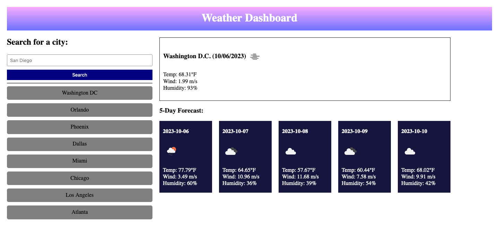

## Challenge Name

weather-forecast

## Screenshot

</img>

## Description

With the help of a few tutor sessions, I was able to create a web application that allows users to input cities for its 5-day forecast and its current weather. It was built using HTML, CSS, and JavaScript and is designed to be simple and user-friendly.

## Deployed Link
[https://jennwintr.github.io/weather-forecast/](https://jennwintr.github.io/weather-forecast/)

## GitHub Link
[https://github.com/jennwintr/weather-forecast](https://github.com/jennwintr/weather-forecast)

